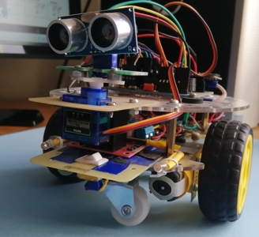
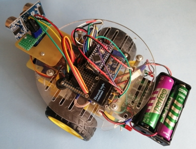
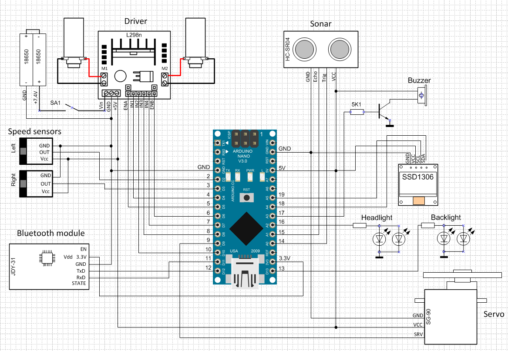

## Arduino-мобиль с управлением по Bluetooth и автономным режимом работы

 ... |
<im src="img/car_front.jpg" alt="view on front" width="500" height="300">

### Назначение
Данный проект носит учебный характер, отдавая дань моде на радиоуправляемые модели авто, базирующиеся на популярной микроконтроллерной плате Arduino.

### Состав и структура
Платформа модели представлет собой двухколесное шасси с двигателями постоянного тока и редукторами. Драйвер двигателей L298N подключен к источнику питания, состоящему из двух аккумуляторных элементов 18650 с суммарным напряжением 7.4V.\
 Драйвер управляет направлением и скоростью вращения двигателей и формирует выходное стабилизированное напряжение 5V для платы Arduino Nano, сенсоров, сервомотора SG-90 и OLED-дисплея 0.96" SSD1306 с разрешением 128x64 px. Для питания модуля Bluetooth JDY-31 служит вывод 3.3V платы Arduino Nano.\
В качестве сенсоров используются ультразвуковой датчик (сонар) HC-SR04 и инфракрасные датчики скорости LM393. Кроме того, автомобиль имеет передние фары (два белых светодиода), задние стоп-сигналы (два красных светодиода), сигнальный пьезоэлемент и выключатель. Все необходимые компоненты приобретены на Aliexpress.\
Схема соединения элементов показана ниже (см. файл *car_scheme.bmp*):

### Режимы работы
Модель может функционировать в одном из двух режимов: получая команды управления от смартфона по Bluetooth, либо двигаясь в автономном режиме с обходом препятствий. Выбор режима происходит при включении питания. Если расстояние до препятствия больше критического (25 см), путь считается свободным, и автомобиль начинает движение в автономном режиме. В противном случае программа переключается в режим управления по Bluetooth, выдает сообщение на дисплей и ожидает команды от смартфона.\
Контроллер Arduino Nano управляет всей логикой работы, а именно:
- измерением расстояния от ультразвукового датчика до препятствия,
- вращением сервомотора при выборе направления обхода препятствия,
- приводом на ведущие колеса, обеспечивающем движение платформы,
- измерением пройденного пути на основе сигналов с датчиков скорости,
- выдачей сообщений на OLED-дисплей,
- световой и звуковой сигнализацией.

### Описание программы
Назначение используемых выводов платы Arduino Nano можно увидеть на схеме и в тексте программы *arduinobtcar.ino*, содержащем комментарии. Используются следующие библиотеки:
- *SoftwareSerial.h* - для подключения модуля Bluetooth,
- *Servo.h* - для управления сервомотором,
- *Wire.h* - для подключения по интерфейсу I2C
- *Adafruit_GFX.h, Adafruit_SSD1306.h* - для подключения OLED-дисплея SSD1306,
- *Fonts/FreeSerif9pt7b.h* - шрифты для OLED-дисплея

Процедура настройки setup состоит из следующих операций:
- инициализация пинов;
- инициализация виртуального серийного порта для модуля Bluetooth;
- настройка сервопривода;
- инициализация OLED-дисплея;
- настройка внешних прерываний по сигналам датчиков скорости.

Использование внешних прерываний\
Датчик скорости правого колеса используется для измерения пройденного пути. Сравнение значений счетчиков импульсов, сформированных датчиками скорости обоих колес при прямолинейном движении, позволяет оценить степень неравномерности их вращения. Измеренные значения отображаются на экране OLED-дисплея.\
При полном обороте колеса 20 слотов на диске датчика формируют 20 импульсов (или 20 передних + 20 задних фронтов импульсов = 40 прерываний).
Каждое прерывание вызывает процедуру обработки прерывания *Right_ISR()* или *Left_ISR()*, соответственно, по фронту сигнала с правого или левого колеса. При движении автомобиля вперед (и соответствующем направлении вращения колес) счетчики инкрементируются.\
Значение стандартной функции *millis()* инкрементируется каждую миллисекунду, начиная со времени включения питания. Если при очередном прерывании сохранить значение функции *millis()* в переменной prevtime, а через 40 прерываний (полный оборот колеса) вновь вызвать эту функцию, то можно вычислить:
- период вращения колеса (интервал, за который колесо делает полный оборот) в милисекундах:\
  *timetaken = millis() - prevtime;* 
- число оборотов в минуту:\
  *rpm = (1000/timetaken) * 60*;
- длину пройденного пути в сантиметрах:\
  *traveled_distance = 6.283 * RADIUS_OF_WHEEL * revolution,*\
  где: *revolution* - число полных оборотов колеса, *RADIUS_OF_WHEEL* - радиус колеса.

Перечислим назначение остальных функций:
- *showCounters* и *showSonarDistance* - отображение на дисплее расчетных показателей;
- *sonar_distance* - определение дистанции до препятствия с помощью ультразвукового датчика без использования внешних библиотек;
- *launch* - начало движения до встречи с препятствием;
- *rollBack* - откат назад;
- *execute* - выполнение команды, полученной по Bluetooth;
- *RMgo, LMgo, RMback, LMback, Stop* - варианты работы моторов;
- *sayBeep, bee, boo* - звуковые сигналы.

Подробности реализации можно узнать, читая комментарии к тексту программы.
